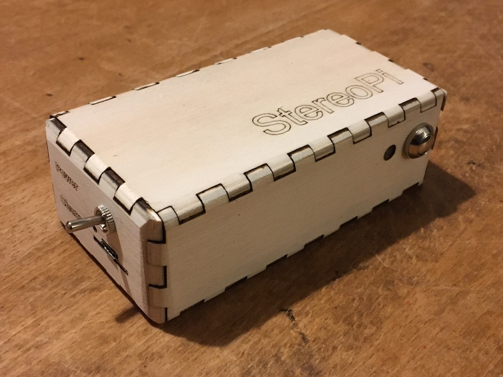

# [stereopi][]

Playing music on a Raspberry Pi zero

# Installation

    curl -sS https://raw.githubusercontent.com/besi/stereopi/master/bin/setup.sh | bash

# Remote control mplayer

Example

    mpc pause

Available commands

    mplayer -input cmdlist

[stereopi]: http://github.com/besi/stereopi
